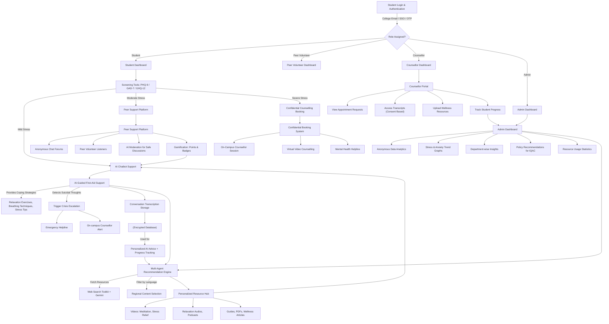

Here’s a **detailed flowchart in Mermaid syntax** that illustrates the **complete workflow of MindMitra** — covering students, AI chatbot, screening tools, multi-agent recommendation system, counsellors, peer support, and admin dashboard.

---

# **📌 Explanation of Flow**

### **1. Student Login & Role Assignment**

* Student logs in → system assigns role (Student, Peer, Counsellor, Admin).
* Depending on the role, each user sees a **different dashboard**.

---

### **2. Screening Tools**

* Students complete **PHQ-9, GAD-7, GHQ-12**.
* System decides the **severity**:

  * Mild → AI Chatbot.
  * Moderate → Peer Support.
  * Severe → Counsellor Booking.

---

### **3. AI Chatbot**

* Provides **coping strategies** (meditation, relaxation).
* Detects **crisis cases** (suicidal thoughts) → triggers emergency alerts.
* Stores **conversation transcripts** in an **encrypted database**.
* Transcripts later help in **personalized advice** & **trend analytics**.

---

### **4. Multi-Agent Recommendation Engine**

* Works alongside chatbot.
* Uses **Gemini + Web Search Toolkit** to fetch **real-time resources**.
* Filters resources by **regional languages**.
* Fills the **Resource Hub** with:

  * Videos (guided meditation, relaxation).
  * Relaxation audios, podcasts.
  * Wellness guides & PDFs.

---

### **5. Confidential Booking System**

* Students can schedule **sessions with counsellors**:

  * On-campus.
  * Virtual video counselling.
  * Or access **helplines** for emergencies.

---

### **6. Peer Support Platform**

* Anonymous forums.
* Trained **peer volunteers** available.
* AI moderates content for **toxicity prevention**.
* Students earn **gamification points** for positive engagement.

---

### **7. Counsellor Portal**

* Counsellors view **bookings & appointments**.
* Access student transcripts (if consent given).
* Upload resources for the **Resource Hub**.
* Track progress and provide follow-up.

---

### **8. Admin Dashboard**

* Admins see **anonymous data only** (no names, no IDs).
* Insights include:

  * Stress/Anxiety levels by department.
  * Usage statistics of chatbot, peer support, counselling.
  * Trends over time to guide **policy decisions**.

---

### **9. Continuous Feedback Loop**

* Data from transcripts, peer forums, counsellors, and admin insights feed back into:

  * Improving **AI chatbot responses**.
  * Enhancing the **resource hub**.
  * Shaping **institutional wellness programs**.

---