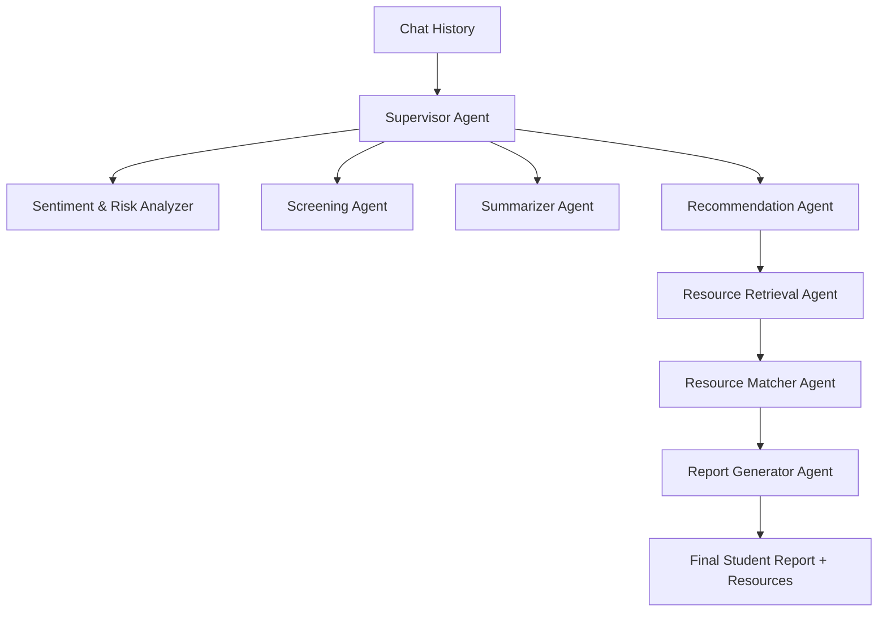

# 🧠 Agent Architecture

## 1. **Sentiment & Risk Analyzer Agent**

* **Role:** Reads conversation history → detects emotions, stress levels, red flags.
* **Output:** Risk score (Low / Moderate / High), alert flag if suicidal ideation/self-harm signs.
* **Tools:** None (LLM only).

---

## 2. **Screening Agent**

* **Role:** Runs standardized psychological tests (PHQ-9, GAD-7, GHQ).
* **Output:** Structured scores for depression/anxiety/general distress.
* **Tools:** Internal scoring logic.

---

## 3. **Conversation Summarizer Agent**

* **Role:** Summarizes chat history into a clean, clinical-style report.
* **Output:** Condensed summary (issues, triggers, patterns).
* **Tools:** None (LLM only).

---

## 4. **Recommendation Agent**

* **Role:** Decides what kind of resources are needed.
* **Output:** Resource categories (guides, research, peer support, relaxation media).
* **Tools:** Delegates to Resource Retrieval Agent.

---

## 5. **Resource Retrieval Agent**

* **Role:** Fetches resources from multiple tools.
* **Tools:**

  * **Tavily Search** (direct answers, wellness guides)
  * **Brave Search** (general + reliable sources)
  * **Jina Search** (semantic, full-page content)
  * **ArXiv Tool** (academic mental health research)
  * **PubMed Tool** (clinical psychology evidence)
  * **Wikipedia Tool** (simple explanations)
  * **YouTube Tool** (guided meditation, relaxation videos)
* **Output:** List of resources mapped to student needs.

---

## 6. **Resource Matcher Agent**

* **Role:** Aligns fetched resources with student’s profile, language, and risk level.
* **Output:** Final curated resource list (personalized).

---

## 7. **Report Generator Agent**

* **Role:** Compiles everything (summary + screening + risk + resources).
* **Output:** Final JSON report for student + anonymized insights for admin.

---

## 8. **Supervisor Agent (LangGraph)**

* **Role:** Orchestrates all agents, decides flow, ensures each agent runs in correct sequence.
* **Output:** Full student psychological support report.

---

# 🌐 Flow Overview

---

✅ Total Agents = **7 core agents + 1 Supervisor**
\= **8 agents in your system**

---