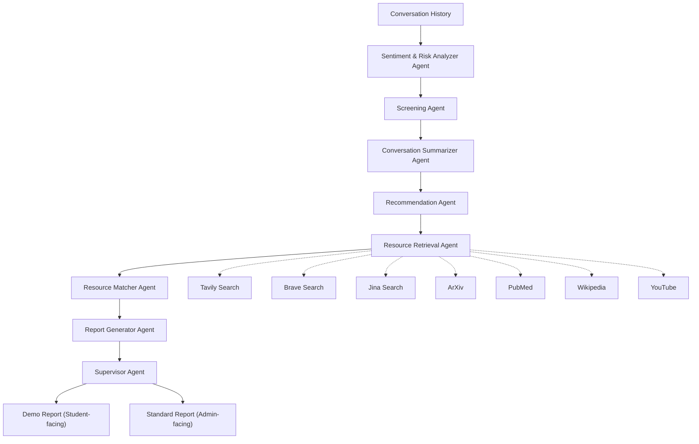

# 🕸️ LangGraph Workflow (Mermaid Diagram)

---

# 📌 Explanation of Flow

1. **Conversation History** → passed in when the student clicks the button.
2. **Sentiment & Risk Analyzer** → detects emotions, red flags.
3. **Screening Agent** → estimates PHQ-9, GAD-7, GHQ scores.
4. **Summarizer Agent** → extracts key points & student concerns.
5. **Recommendation Agent** → decides what categories of resources are needed.
6. **Resource Retrieval Agent** → queries tools (Tavily, Brave, Jina, ArXiv, PubMed, Wikipedia, YouTube).
7. **Resource Matcher Agent** → filters best matches for student context.
8. **Report Generator Agent** → builds **Demo & Standard reports**.
9. **Supervisor Agent** → orchestrates everything & ensures consistent JSON.

---